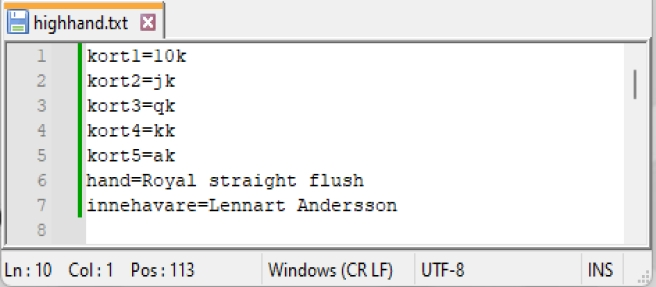

# HIGH HAND

En enkel, hyffsat responsiv websida att köra i fullscreen för att visa aktuell HIGH HAND.

Smidig att köra lokalt tillsammans med "[Simple Web Server](https://simplewebserver.org/)"
___
### Handhavande

Öppna filen highhand.txt i en texteditor.

Uppdatera korten, handen & innehavare för aktuell HH och spara.

Websidan uppdateras automatiskt.

Smidigt att ha den öppna highhand.txt på en skärm och visa websidan i fullscreen på en annan skärm.
___

### Installera / Uppdatera till senaste versionen från github

1. Tabort C:/high_hand
2. Starta Windows Terminal
3. Gå till rooten på C:
4. ```git clone https://github.com/mcfrojd/high_hand.git```
___

### Saker du behöver för att det ska fungera i Windows

1. [GIT för Windows](https://git-scm.com/book/en/v2/Getting-Started-Installing-Git)
2. [Windows Terminal](https://apps.microsoft.com/detail/9n0dx20hk701?amp%3Bgl=se&hl=sv-SE&gl=SE)
3. [Simple Web Server](https://simplewebserver.org/)
___

### Screenshots



___
